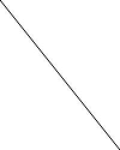

Interpolation techniques
========================

This article will cover a few of the standard techniques for temporal video frame interpolation, outlining in particular the difference between techniques like SVP/MVtools (also known as motion-based interpolation) and algorithms like smoothmotion. You can also find a set of test clips specifically designed to replicate the results of these algorithms, alongside some more explanation, in [this repository](https://github.com/haasn/interpolation-samples).

To demonstrate the differences, we will look at what happens when trying to
display a 24 Hz video file on 60 Hz monitor. This is the source file I will be
using. For illustration, each video frame will appear as one horizontal line of
the image. (So the vertical axis is the time axis)

We will now discuss different techniques of converting this to a 60 Hz video
stream (suitable for display on a 60 Hz monitor, for example). As a result, the
vertical axis will be rescaled from 100 pixels to 250 pixels. (60/24 = 2.5)

3:2 pulldown
============

The traditional technique, including the default mpv behavior, is to simply
hold each source frame until the corresponding timestamp of the next frame has
passed. Due to the particular ratio in this example (60/24 = 2.5), it means
that the first frame will be shown 3 times, the second frame 2 times, the third
3 times, the fourth 2 times and so on. The pattern looks like this:

    A A A B B C C C D D E E E F F

As can be clearly seen, the inconsistent width results in a jagged appearance,
which is a visualization of the phenomenon known as judder.

This technique is essentially like nearest neighbour upscaling - each frame simply picks the source frame that's closest to it in the original video source (rounded down).

Motion-based interpolation
==========================

Motion-based interpolation algorithms like SVP, MVTools or the chips built into
various TV devices employ complex algorithms to try and recognize movement in
the video (motion vectors), and fill in the missing gaps as needed.

This drastically alters the result - it's now one continuous motion, similar
to a true 60 Hz clip. However, this comes at a cost - not only are the
mathematics involved extremely expensive to compute, but the algorithms also
aren't perfect, and often result in artifacts (deformed images, wavy lines,
etc.).

Furthermore, this is the source of the so-called soap opera effect, which is
simply referring to what 60 Hz motion looks like. The name is based on the
fact that cheap TV programs like soap operas are often filmed at interlaced 60
Hz rather than the (more expensive) film format that most cinematic content
uses, which is usually shot at 24 Hz. Many people therefore subconsciously
associate the visual appearance of 60 Hz content with soap operas, and thus
think it looks worse.

This is essentially similar to "smart" upscaling filters, eg. NEDI or NNEDI3 - which are also expensive to compute and produce results that drastically alter the source image.

Smoothmotion
============

The smoothmotion approach is to display each frame exactly 2.5 times, where we
display frames for 0.5 times by blending two adjacent frames together. In terms
of the pattern, it results in something like this:

    A A A+B B B C C C+D D D E E E+F F F

Here, A+B refers to a frame that is exactly half of A and half of B, blended
together. The overall result is that each frame is displayed for a consistent
amount of time, resulting in smooth motion.

As you can see, the overall appearance is smoother due to the increased
regularity of the frame heights, and the overall perceived framerate (24 Hz)
has not been affected - the lines are still clearly distinct.

This is not only easy to calculate (no motion-based prediction whatsoever, just
a simple blending operation of two frames), but also preserves the perceived
framerate of the original clip, so there's no soap opera effect or similar.

Essentially, smoothmotion is like using a nearest neighbour resize but
oversampling the result (similar to how multi-sampling works in video games to
reduce aliasing). Due to this, it's called "oversample" in the mpv implementation.

Convolution-based interpolation
===============================

This mode of operation is based on the idea to treat the time dimension of a video clip as just another static dimension, the same as the resolution - essentially, we are treating the input as a big 3D signal
of size Width×Height×Duration, reconstructing this input using standard techniques from signal theory. Basically, instead of convolving the kernel with discrete pixels in the source image, we convolve the kernel with the same pixels across discrete frames.

The main difference to smoothmotion is that it essentially low-passes the
time axis to make sure no high frequency distortions get added (which can look
like irregularities with the smoothmotion algorithm), and that it can
reconstruct some “intermediate” pixel values, which works well for slow motion
in particular, but can add extra motion blur in some cases.

As you can see, the overall appearance looks similar to smoothmotion, but
instead of frame transitions alternating between sharp and blended, each frame
is always blended into the next one.

There is also a theoretically plausible mode of operation known as "Sphinx", which is based on interpolating all three dimensions at the same time using a carefully constructed filter that has a perfectly spherical frequency response, which is speculated to be better at preserving frequencies on diagonal lines (eg. static images in motion). The naming is based on a continuation of Sinc and Jinc, with Sphinx standing for sphere as the 3D analog of the others, which are for 1D and 2D, respectively. While available in https://github.com/haasn/mpv/commit/7d10c9b76f39bfd2fe606b8702b39888d117c685 for the curious, it won't make it into master as it's excessively slow and offers no visible benefit, while also ringing too strongly at radius 3 or above. (If anything, it would have to be used with some sort of temporal antiringing)
