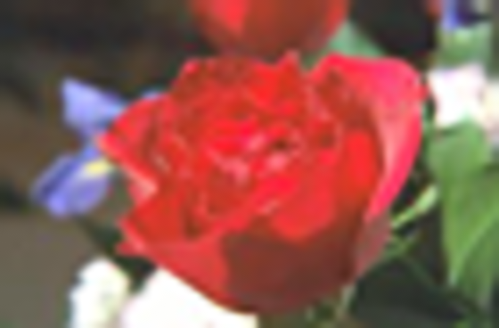
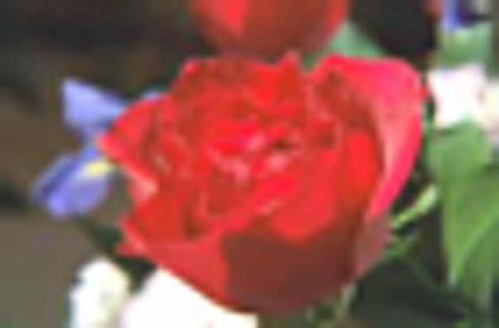
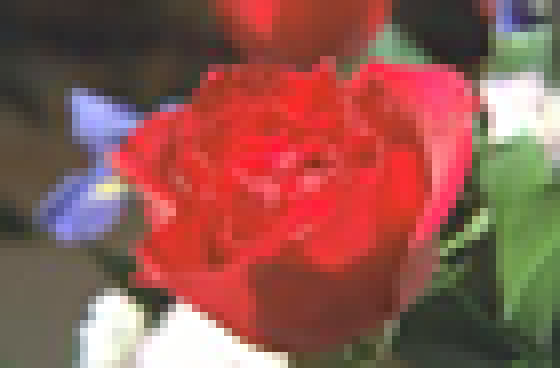

Upscaling
=========

There are many available upscaling (interpolation) techniques in mpv, of which this article aims to provide some comparison screenshots.

**Note:** This article has mostly been superseded by [this repository](https://github.com/haasn/mpvhq-upscalers), which catalogs and compares more upscalers and test files than this page, and will also be kept more up-to-date.

Methodology
===========

The source image for all of these is imagemagic's built-in “rose” test pattern, which can be obtained like this:

    convert rose: rose.png

Each of the screenshots was obtained like this:

    mpv --no-config --pause rose.png --geometry=560x368 -vo opengl-hq:dither-depth=8:scale=SCALER

The resulting output was captured using imagemagick:

    import -depth 8 SCALER.png

Results
=======

    scale=bilinear

    scale=lanczos

    scale=mitchell

    scale=spline16

    scale=spline36

    scale=spline64

    scale=ewa_lanczos

    scale=ewa_lanczos:scale-radius=3.2383154841662362

    scale=ewa_lanczossharp

    scale=ewa_lanczossoft

    scale=robidoux

    scale=robidouxsharp

    scale=ewa_ginseng

    scale=ewa_hanning

    scale=bicubic

    scale=gaussian

    scale=catmull_rom

    scale=nearest

    scale=oversample

    scale=sharpen3

    scale=sharpen5

    scale=sinc:scale-radius=16

Antiringing
===========

Some of the upscalers support antiringing, which is a naive technique that attempts to reduce ringing in some cases, but can also introduce artifacts. The antiringing algorithm in mpv is not very sophisticated.

    scale=spline36:scale-antiring=1

    scale=lanczos:scale-antiring=1

    scale=ewa_lanczossharp:scale-antiring=1

Other upscaling methods
=======================

There are also ways to upscale images other than by using the scale option, such as using a vapoursynth script. (Note that using vapoursynth on still images in mpv is somewhat tricky, and working with RGB colors is also difficult. To produce these images, the source PNG was split into three separate grayscale images (for R, G and B) and merged into a movie clip of length 3. Each frame of the output was captured and converted back to an RGB image)

    core.nnedi3.nnedi3_rpow2(video_in, 8).set_output()

